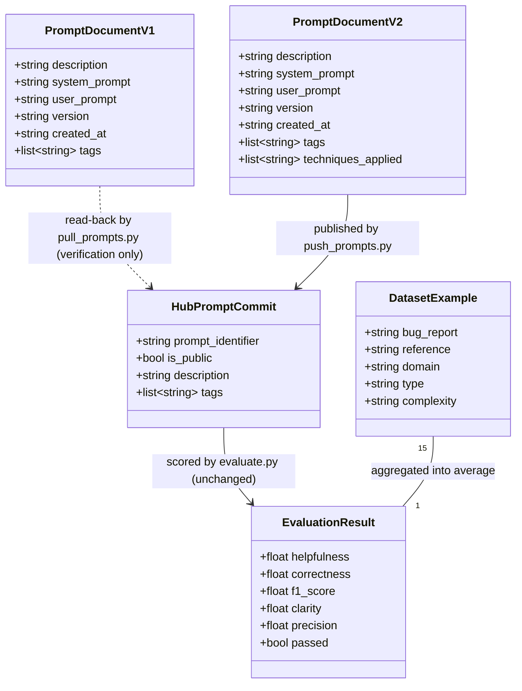

# Bug-to-User-Story Prompt Optimization Pipeline (v2)

## Requirements

Implement the pull→author→push→validate pipeline that replaces the deliberately flawed `bug_to_user_story_v1` prompt with a persona-driven, chain-of-thought, few-shot-reinforced `bug_to_user_story_v2` prompt on the LangSmith Prompt Hub, plus the supporting scripts and tests needed to publish and structurally verify it — so that the existing, unmodified evaluation gate in `evaluate.py` can score it against all 5 required metrics.

## Entities



Note: these are **data shapes**, not new Python classes. `PromptDocumentV1`/`V2` are the existing `Dict[str, Any]` shape already produced/consumed by `utils.load_yaml`/`utils.save_yaml` (see `prompts/bug_to_user_story_v1.yml` for the live example). `HubPromptCommit` is the `langchain_core.prompts.ChatPromptTemplate` object as pushed via `langsmith.Client().push_prompt`. `DatasetExample` and `EvaluationResult` already exist as plain dicts inside `evaluate.py`/`metrics.py`. No new entity classes, dataclasses, or Pydantic models should be introduced — the codebase's existing convention is plain dicts + YAML/JSON round-trips.

## Approach

1. **Pipeline Strategy**:
   - Follow the repository's existing skeleton/complete-module split: `pull_prompts.py` and `push_prompts.py` are procedural scripts with a `main()` entry point (`sys.exit(main())`), mirroring the already-complete `evaluate.py`'s structure and console-output style (`print_section_header`, ✓/❌ symbols).
   - No object-oriented layering (no classes, no DI framework) — this matches the existing codebase exactly; introducing OOP structure here would be unnecessary refactoring.
   - `prompts/bug_to_user_story_v2.yml` is the actual quality-bearing artifact; the scripts around it are thin, mechanical I/O.

2. **Technical Implementation**:
   - Use `langsmith.Client().push_prompt(prompt_identifier, object=chat_prompt_template, is_public=True, description=..., tags=[...])` for publishing — confirmed via LangChain reference docs as the parameter surface that exposes `is_public`/`description`/`tags` (the thinner `langchain.hub.push` wrapper does not expose these).
   - Use `langchain.hub.pull(prompt_name)` for pulling (already the pattern proven working in `evaluate.py`'s `pull_prompt_from_langsmith`).
   - Build/deconstruct prompts via `langchain_core.prompts.ChatPromptTemplate.from_messages([("system", system_prompt), ("user", user_prompt)])`; extract template text back out via each message's `.prompt.template` attribute.
   - No web framework, no REST layer, no `GlobalExceptionHandler` applies here — this is a CLI pipeline. Error handling instead follows the pattern already established in `evaluate.py`'s `pull_prompt_from_langsmith`: catch the exception, print a structured, actionable remediation block, and either `raise`/`return 1` so `main()` exits non-zero.
   - Reuse `utils.check_env_vars`, `utils.load_yaml`, `utils.save_yaml`, `utils.validate_prompt_structure`, `utils.print_section_header` — do not duplicate this logic in the new scripts.

3. **Business Logic — v2 Prompt Content**:
   - **Role Prompting**: system prompt opens with a senior Product Owner / Business Analyst persona — establishes professional-but-empathetic tone (drives Clarity, and the tone/empathy dimension implicitly rewarded by the reference user stories).
   - **Chain-of-Thought**: system prompt instructs an internal reasoning phase before drafting — (1) identify the affected user/persona, (2) extract concrete technical facts (error messages, steps to reproduce, impact/severity if present), (3) classify the bug's complexity (simple / medium / complex) from those signals, (4) only then draft the user story at the appropriate depth. This directly targets Precision (fact extraction, no invention) and F1 (recall of reference-relevant details).
   - **Few-shot Learning**: 3 embedded examples, one per complexity tier, teaching the complexity-adaptive output contract discovered in the dataset (see Operations for exact content).
   - **Complexity-Adaptive Output Contract**: simple bugs → user story + ~5 plain acceptance-criteria bullets; medium bugs with technical detail → add a "Contexto Técnico" section; complex/multi-issue bugs → full structure with Título, Descrição, lettered criteria groups (A/B/C/D...), Critérios Técnicos, Contexto do Bug, Tasks Técnicas Sugeridas. The model must infer which tier applies from the bug report text alone (the complexity metadata is never passed at inference time).
   - **Edge-case handling rules** (explicit in the system prompt): bug reports with no reproduction steps → do not invent them, ask the reasoning phase to note what's missing and produce acceptance criteria only for what's stated; bug reports mixing multiple unrelated problems → split into multiple lettered criteria groups, one per problem, never merge distinct problems into one criterion; non-technical/vague bug reports (e.g. "está lento") → still infer a plausible persona and value statement without fabricating specific technical root causes not present in the input.
   - **Validation logic**: `utils.validate_prompt_structure()` gate inside `push_prompts.py.validate_prompt()` before any network call — fail fast locally rather than discovering a malformed prompt only after publishing.

## Structure

### Module Layer (no class inheritance in this codebase — function/module based)

1. `prompts/bug_to_user_story_v2.yml` — the content artifact (data, not code).
2. `src/pull_prompts.py` — data ingress: Hub → local YAML. Depends on `langchain.hub`, `src/utils.py` (`save_yaml`, `check_env_vars`, `print_section_header`).
3. `src/push_prompts.py` — data egress + validation: local YAML → Hub. Depends on `src/utils.py` (`load_yaml`, `check_env_vars`, `print_section_header`, `validate_prompt_structure`), `langchain_core.prompts.ChatPromptTemplate`, `langsmith.Client`.
4. `tests/test_prompts.py` — structural validation layer over the YAML artifact. Depends on `src/utils.py` (`validate_prompt_structure`) and the module-level `load_prompts()` helper already present in the test file.
5. `src/utils.py`, `src/evaluate.py`, `src/metrics.py` — **unchanged**, consumed as-is.

### Dependencies

1. `push_prompts.main()` calls `push_prompts.validate_prompt()` before `push_prompts.push_prompt_to_langsmith()` — validation is a hard gate, not advisory.
2. `push_prompts.push_prompt_to_langsmith()` calls `langsmith.Client().push_prompt(...)`; `pull_prompts.pull_prompts_from_langsmith()` calls `langchain.hub.pull(...)`.
3. `tests/test_prompts.py` calls `utils.validate_prompt_structure()` directly (same function `push_prompts.py` gates on) plus its own finer-grained assertions (persona wording, format markers, few-shot markers) not covered by `validate_prompt_structure`.
4. `evaluate.py` (unchanged) is the downstream consumer that calls `hub.pull(f"{username}/bug_to_user_story_v2")` — it has zero code dependency on the new scripts; the only coupling is "a successful `push_prompts.py` run must have happened first."

### Execution-Order Layering

1. Content layer: author `prompts/bug_to_user_story_v2.yml`.
2. Verification layer: `pytest tests/test_prompts.py` (fast, local, no network/LLM calls).
3. Publish layer: `python src/push_prompts.py` (network call to LangSmith).
4. Scoring layer: `python src/evaluate.py` (unchanged, network + LLM calls).
5. Iterate: steps 1–4 repeated, editing only `prompts/bug_to_user_story_v2.yml` between rounds.

## Operations

### Implement `src/pull_prompts.py`

1. Responsibility: pull `leonanluppi/bug_to_user_story_v1` from the LangSmith Hub and save it to `prompts/bug_to_user_story_v1.yml`, in the same schema as the currently committed file (`bug_to_user_story_v1:` top-level key with `description`, `system_prompt`, `user_prompt`, `version`, `created_at`, `tags`).
2. Method: `pull_prompts_from_langsmith() -> Optional[Dict[str, Any]]`
   - Logic:
     - Call `hub.pull("leonanluppi/bug_to_user_story_v1")` to get a `ChatPromptTemplate`.
     - Iterate `prompt.messages`; for each message, read `.prompt.template` and its role (`SystemMessagePromptTemplate` → `system_prompt`, `HumanMessagePromptTemplate` → `user_prompt`).
     - Build the dict: `{"bug_to_user_story_v1": {"description": ..., "system_prompt": <extracted>, "user_prompt": <extracted>, "version": "v1", "created_at": <today, ISO date>, "tags": ["bug-analysis", "user-story", "product-management"]}}` — description/tags mirror the values already in the committed `v1.yml` since the pulled prompt is the same content.
     - Return the dict, or `None` on failure (mirroring `utils.load_yaml`'s `Optional` return convention).
   - Edge case: if `hub.pull` raises, print a clear error (missing `LANGSMITH_API_KEY`, network issue, or prompt renamed) and return `None` — do not let a raw traceback surface.
3. Method: `main() -> int`
   - Logic:
     - `print_section_header("PULL DE PROMPTS DO LANGSMITH HUB")`.
     - `check_env_vars(["LANGSMITH_API_KEY"])` → return `1` if missing.
     - Call `pull_prompts_from_langsmith()`; if `None`, return `1`.
     - `save_yaml(result, "prompts/bug_to_user_story_v1.yml")`; return `0` on success, `1` on failure.
4. Constraints: must not alter the semantic content of `v1.yml` — it stays deliberately bad; this script only proves the round-trip works.

### Author `prompts/bug_to_user_story_v2.yml`

1. Responsibility: the actual optimized prompt content — the quality-bearing deliverable.
2. Top-level structure (mirrors `v1.yml`'s shape, extended with `techniques_applied`):
   ```yaml
   bug_to_user_story_v2:
     description: "Prompt otimizado para converter relatos de bugs em User Stories, com persona, raciocínio estruturado e exemplos few-shot"
     system_prompt: |
       <see content spec below>
     user_prompt: "{bug_report}"
     version: "v2"
     created_at: "<today's date, ISO format>"
     tags: ["bug-analysis", "user-story", "product-management", "role-prompting", "chain-of-thought", "few-shot"]
     techniques_applied:
       - "Role Prompting"
       - "Chain-of-Thought (CoT)"
       - "Few-shot Learning"
   ```
3. `system_prompt` content specification (in this order, every section required, zero `TODO` markers):
   - **Persona**: "Você é um Product Owner sênior especializado em transformar relatos de bugs em User Stories claras e acionáveis para times de desenvolvimento ágil. Você tem profundo conhecimento de práticas de User Story (formato Como/Eu quero/Para que) e Critérios de Aceitação testáveis."
   - **Regras explícitas de comportamento** (numbered list): (a) nunca inventar informações não presentes no relato do bug; (b) sempre usar o formato "Como um [persona], eu quero [ação], para que [benefício]"; (c) sempre incluir uma seção "Critérios de Aceitação" separada, no formato Given-When-Then (Dado/Quando/Então); (d) adaptar a profundidade da resposta à complexidade do bug (ver Raciocínio abaixo); (e) nunca reescrever ou repetir o relato de bug literalmente na resposta.
   - **Raciocínio estruturado (Chain-of-Thought)**, instructed as explicit internal steps before answering: (1) identificar o usuário/persona afetado; (2) extrair fatos técnicos concretos presentes no relato (mensagens de erro, passos para reproduzir, impacto/severidade, se houver); (3) classificar a complexidade do bug como simples, médio ou complexo com base na quantidade de problemas distintos e detalhes técnicos presentes; (4) só então redigir a User Story na profundidade apropriada.
   - **Contrato de saída adaptativo por complexidade** (explicit rules, matching the pattern found in the reference dataset):
     - Simples: User Story + Critérios de Aceitação (3-5 bullets), sem seção técnica.
     - Médio: User Story + Critérios de Aceitação + seção "Contexto Técnico" quando o relato mencionar logs, endpoints, ou causas técnicas.
     - Complexo (múltiplos problemas distintos ou impacto/severidade explícitos): User Story principal + Critérios de Aceitação organizados em grupos rotulados (A, B, C...), um grupo por problema distinto + seção "Critérios Técnicos" + seção "Contexto do Bug" (severidade, impacto) + seção "Tasks Técnicas Sugeridas".
   - **Tratamento de edge cases** (explicit): relatos sem passos de reprodução → não inventar passos, focar os critérios de aceitação no que foi afirmado; relatos com múltiplos problemas não relacionados → um grupo de critérios por problema, nunca misturar; relatos vagos/não técnicos → inferir uma persona e um valor de negócio plausíveis sem inventar causa técnica específica.
   - **Few-shot Examples** (3 complete examples, embedded verbatim in the system prompt, in this exact order simple → medium → complex):

   **Exemplo 1 (Simples)**
   Bug: `"O link 'Esqueci minha senha' na tela de login não abre nenhuma página, apenas fica carregando indefinidamente."`
   Resposta esperada:
   ```
   Como um usuário que esqueceu sua senha, eu quero acessar a página de redefinição de senha ao clicar no link "Esqueci minha senha", para que eu possa recuperar o acesso à minha conta rapidamente.

   Critérios de Aceitação:
   - Dado que estou na tela de login
   - Quando clico no link "Esqueci minha senha"
   - Então devo ser redirecionado para a página de redefinição de senha
   - E a página deve carregar em menos de 3 segundos
   - E não deve haver indicador de carregamento infinito
   ```

   **Exemplo 2 (Médio)**
   Bug: `"Exportação de relatório em PDF falha para relatórios com mais de 200 páginas. Erro no console: 'Maximum call stack size exceeded' na função generatePDF(). Acontece apenas no navegador Firefox."`
   Resposta esperada:
   ```
   Como um usuário exportando relatórios extensos, eu quero gerar PDFs com mais de 200 páginas sem falhas, para que eu possa compartilhar relatórios completos independentemente do navegador utilizado.

   Critérios de Aceitação:
   - Dado que solicito a exportação de um relatório com mais de 200 páginas
   - Quando o sistema processa a geração do PDF
   - Então o arquivo deve ser gerado com sucesso, sem erros
   - E o comportamento deve ser consistente entre navegadores (incluindo Firefox)
   - E o tempo de exportação deve permanecer dentro de um limite aceitável

   Contexto Técnico:
   - Erro reportado: "Maximum call stack size exceeded" na função generatePDF()
   - Navegador afetado: Firefox
   - Causa provável: recursão ou acúmulo de chamadas sem otimização para volumes grandes de páginas
   ```

   **Exemplo 3 (Complexo)**
   Bug: `"Sistema de notificações push com múltiplos problemas: (1) SEGURANÇA - tokens de dispositivo são logados em texto plano nos logs do servidor, visíveis para qualquer pessoa com acesso aos logs; (2) DUPLICAÇÃO - usuários recebem a mesma notificação até 5 vezes seguidas quando têm múltiplos dispositivos cadastrados; (3) PERFORMANCE - envio de notificações em massa (10k+ usuários) trava a fila de processamento por até 20 minutos, atrasando notificações críticas de outros eventos. IMPACTO: 40+ reclamações de usuários na última semana, e o time de segurança marcou o vazamento de tokens como severidade ALTA."`
   Resposta esperada:
   ```
   Como um usuário do aplicativo, eu quero receber notificações push de forma segura, única e sem atrasos, para que eu confie no sistema e não seja incomodado por comportamentos indevidos.

   === CRITÉRIOS DE ACEITAÇÃO ===

   A. Segurança - Tokens de dispositivo protegidos:
   - Dado que um token de dispositivo é processado pelo servidor
   - Quando o evento é registrado em log
   - Então o token não deve aparecer em texto plano no log
   - E deve ser mascarado ou omitido do registro

   B. Deduplicação - Notificação única por evento:
   - Dado que um usuário possui múltiplos dispositivos cadastrados
   - Quando uma notificação é disparada para esse usuário
   - Então cada dispositivo deve receber a notificação no máximo uma vez
   - E não deve haver reenvio duplicado do mesmo evento

   C. Performance - Envio em massa sem travar a fila:
   - Dado que uma notificação é enviada para 10k+ usuários
   - Quando o envio em massa é processado
   - Então a fila de processamento não deve ficar bloqueada para outros eventos
   - E notificações críticas de outros eventos devem continuar sendo entregues sem atraso

   === CRITÉRIOS TÉCNICOS ===
   - Mascarar ou remover tokens de dispositivo dos logs (ex.: exibir apenas os últimos 4 caracteres)
   - Implementar controle de idempotência por (usuário, evento) para evitar reenvio duplicado
   - Processar envios em massa de forma assíncrona/particionada, sem bloquear a fila principal

   === CONTEXTO DO BUG ===
   - Severidade: ALTA (vazamento de dados sensíveis + degradação de serviço)
   - Impacto: 40+ reclamações de usuários na última semana
   - Problemas identificados: exposição de tokens em log, duplicação de notificações, bloqueio de fila em envios em massa

   === TASKS TÉCNICAS SUGERIDAS ===
   1. [SEGURANÇA] Mascarar tokens de dispositivo antes de qualquer log
   2. [BACKEND] Implementar chave de idempotência por (usuário, evento) para notificações
   3. [PERFORMANCE] Migrar envio em massa para processamento assíncrono particionado
   4. [MONITORING] Adicionar alerta para tempo de bloqueio de fila > 1 minuto
   ```
4. Constraints: `{bug_report}` must appear exactly once across `system_prompt` + `user_prompt` combined, and only inside `user_prompt`; `system_prompt` must not contain the literal substring `TODO`; `techniques_applied` must have exactly the 3 entries listed (>= 2 required, 3 chosen).

### Implement `src/push_prompts.py`

1. Interface: existing skeleton signatures — `push_prompt_to_langsmith(prompt_name: str, prompt_data: dict) -> bool`, `validate_prompt(prompt_data: dict) -> tuple[bool, list]`, `main() -> int`.
2. Method: `validate_prompt(prompt_data: dict) -> tuple[bool, list]`
   - Logic: thin wrapper delegating to `utils.validate_prompt_structure(prompt_data)` — do not reimplement validation rules already centralized in `utils.py`.
3. Method: `push_prompt_to_langsmith(prompt_name: str, prompt_data: dict) -> bool`
   - Input Validation: none here (already gated by `validate_prompt` in `main()` before this is called).
   - Business Logic:
     - Build `ChatPromptTemplate.from_messages([("system", prompt_data["system_prompt"]), ("user", prompt_data["user_prompt"])])`.
     - Call `Client().push_prompt(prompt_name, object=chat_prompt_template, is_public=True, description=prompt_data.get("description", ""), tags=prompt_data.get("tags", []) + prompt_data.get("techniques_applied", []))`.
     - Print the returned Hub URL on success.
   - Exception Handling: catch broadly, print a structured error block (credentials, network, or naming issue), return `False`.
   - Return Value: `bool` success flag per the existing skeleton's declared return type.
4. Method: `main() -> int`
   - Logic:
     - `print_section_header("PUSH DE PROMPTS OTIMIZADOS PARA O LANGSMITH HUB")`.
     - `check_env_vars(["LANGSMITH_API_KEY", "USERNAME_LANGSMITH_HUB"])` → return `1` if missing.
     - `load_yaml("prompts/bug_to_user_story_v2.yml")` → if `None`, return `1`.
     - Extract the inner `bug_to_user_story_v2` dict from the loaded YAML (same nesting pattern as `v1.yml`).
     - `is_valid, errors = validate_prompt(prompt_data)` → if not valid, print each error, return `1` (fail fast, never push an invalid prompt).
     - Build `prompt_name = f"{os.getenv('USERNAME_LANGSMITH_HUB')}/bug_to_user_story_v2"`.
     - Call `push_prompt_to_langsmith(prompt_name, prompt_data)` → return `0` on success, `1` on failure.
5. Constraints: `USERNAME_LANGSMITH_HUB` must come from the environment, never be hardcoded (the pull source `leonanluppi/...` is hardcoded per spec, but the push target is per-developer); `is_public=True` must be passed explicitly on every call, not assumed to persist from a prior manual toggle.

### Implement the 6 tests in `tests/test_prompts.py`

Use the file's existing `load_prompts("prompts/bug_to_user_story_v2.yml")` helper and unwrap the inner `bug_to_user_story_v2` dict in each test (or once via a fixture/class-level load — follow whatever minimal pattern keeps each test independent and readable).

1. `test_prompt_has_system_prompt`: assert `"system_prompt"` key exists and, after `.strip()`, is non-empty.
2. `test_prompt_has_role_definition`: assert the `system_prompt` contains persona-indicating text (e.g. contains `"Você é"` and a role keyword such as `"Product Owner"`).
3. `test_prompt_mentions_format`: assert the `system_prompt` mentions the User Story format markers (e.g. contains `"Como um"`, `"eu quero"`, `"para que"`) or the word `"Markdown"`.
4. `test_prompt_has_few_shot_examples`: assert the `system_prompt` contains multiple example markers (e.g. contains `"Exemplo 1"` and `"Exemplo 2"`, or at least 2 occurrences of a recognizable example delimiter).
5. `test_prompt_no_todos`: assert `"TODO"` is not a substring of `system_prompt` (case-sensitive match on the literal marker, matching `utils.validate_prompt_structure`'s own check).
6. `test_minimum_techniques`: assert `len(prompt_data.get("techniques_applied", [])) >= 2`; additionally assert the same via `utils.validate_prompt_structure(prompt_data)` returning `(True, [])` — this ties the pytest suite to the shared validation source of truth so the two never drift.

## Norms

1. **Docstring/Comment Language**: Portuguese, matching every existing module (`evaluate.py`, `metrics.py`, `utils.py`) — do not introduce English docstrings in new code.
2. **Console Output Style**: reuse `print_section_header`, and the `✓`/`❌`/`⚠️` symbol conventions already used throughout `evaluate.py` — new scripts must look and feel identical to the existing ones, not introduce a different logging style.
3. **Shared Helpers Reuse**: always call into `utils.py` (`load_yaml`, `save_yaml`, `check_env_vars`, `validate_prompt_structure`, `print_section_header`) instead of reimplementing equivalent logic locally.
4. **Function Signatures**: preserve the exact function names and signatures already declared in the `pull_prompts.py`/`push_prompts.py` skeletons — only fill in bodies (`...` → implementation), do not rename or add new public functions unless strictly necessary.
5. **YAML Style**: `system_prompt` written as a literal block scalar (`|`) exactly like `v1.yml`, so multi-line content round-trips predictably through `yaml.safe_load`/`yaml.dump`.
6. **Error Handling Pattern**: catch exceptions at the boundary of each external call (Hub pull/push), print a structured, actionable message (what failed + how to fix it), and return/exit non-zero — never let a raw stack trace be the only output for an expected failure mode (missing env var, 404, network error), following `evaluate.py`'s `pull_prompt_from_langsmith` as the reference pattern.
7. **No New Dependencies**: implement entirely with packages already pinned in `requirements.txt` (`langchain`, `langchain-core`, `langsmith`, `pyyaml`, `python-dotenv`) — do not add new packages for this work.
8. **Environment Access**: read config via `os.getenv(...)`, matching `utils.get_llm`'s pattern — never hardcode credentials or usernames.

## Safeguards

1. **Functional Constraints**: `pull_prompts.py` must not alter the semantic content of `prompts/bug_to_user_story_v1.yml` (it is intentionally bad); `push_prompts.py` must only ever read from `prompts/bug_to_user_story_v2.yml`.
2. **Immutable Files**: `src/evaluate.py`, `src/metrics.py`, `src/utils.py`, and `datasets/bug_to_user_story.jsonl` must not be modified by this work.
3. **Performance Constraints**: no new performance requirement introduced by this pipeline itself; note (carried from analysis) that `evaluate.py` runs take a minimum of ~4 minutes on Gemini free-tier rate limits (15 req/min) — this is inherent to the unchanged evaluation script, not something the new code can or should optimize.
4. **Security Constraints**: never log or print full API key values; `.env` stays gitignored and untouched by any script; error messages may name which env var is missing but must not echo its value.
5. **Integration Constraints**: every `push_prompt` call must pass `is_public=True` explicitly; the push target must be built from `USERNAME_LANGSMITH_HUB` (env), never hardcoded; the pull source stays hardcoded to `leonanluppi/bug_to_user_story_v1` per the challenge spec.
6. **Business Rule Constraints**: `techniques_applied` must contain >= 2 entries (currently 3: Role Prompting, Chain-of-Thought, Few-shot Learning); `system_prompt` must contain zero occurrences of the literal string `TODO`; `{bug_report}` must appear exactly once, only in `user_prompt`.
7. **Error-Handling Constraints** (adapted — no web framework in this codebase): all expected failure modes (missing env vars, Hub 404, network errors, local validation failures) must produce a structured, actionable console message and a non-zero exit code from `main()`; unexpected exceptions must not silently swallow — they should still surface, but through the same structured-error pattern rather than a bare traceback where reasonably avoidable.
8. **Technical Constraints**: Python 3.9+ compatible syntax only; no new third-party dependencies; must remain compatible with the pinned `langchain==0.3.13` / `langsmith==0.2.7` API surface confirmed during analysis (`Client().push_prompt` signature).
9. **Data/Validation Constraints**: `prompts/bug_to_user_story_v2.yml` must pass `utils.validate_prompt_structure()` before any push is attempted (hard local gate); the 6 tests in `tests/test_prompts.py` must all pass before a push is considered ready; the shared 0.8-per-metric acceptance bar (Helpfulness, Correctness, F1-Score, Clarity, Precision, checked individually — not just the average) is enforced downstream by the unchanged `evaluate.py`/`display_results`, and is validated empirically through iteration, not by any new code in this pipeline.
