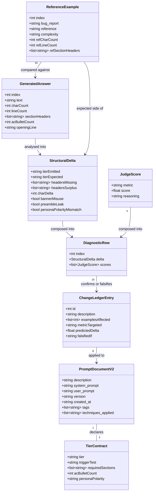

# Bug-to-User-Story v2 Prompt — Metric Remediation (Iteration 3)

## Requirements

Diagnose and remediate the three failing judge metrics (`precision` 0.73, `clarity` ~0.795, and the derived `helpfulness` 0.765) on the published `azgrom/bug_to_user_story_v2` prompt, by first localising where generated output deviates from the immutable 15-example reference corpus, then applying eight evidence-bound corrections to `prompts/bug_to_user_story_v2.yml` — the only mutable artefact in the pipeline — so that all five reported metrics clear 0.80 with enough margin (~0.85) to survive judge nondeterminism, while protecting the already-passing `f1_score` of 0.90.

Scope boundary: the remediation must be expressed entirely inside the v2 prompt text. `src/evaluate.py`, `src/metrics.py`, `src/utils.py` and `datasets/bug_to_user_story.jsonl` are read-only. Changing the subject or judge model is out of scope — it would optimise the runtime rather than the prompt.

## Entities

**Conservative constraints applied to this model.** `PromptDocumentV2` keeps its exact existing YAML key set — `validate_prompt_structure` (`src/utils.py:119`) requires `description`, `system_prompt`, `version` and ≥2 `techniques_applied`, and `push_prompts.py:35-38` reads `system_prompt` and `user_prompt` by name. No key may be renamed, removed or nested. `TierContract`, `StructuralDelta` and `DiagnosticRow` exist **only inside the throwaway diagnostic script** as plain dicts or dataclasses; they are not persisted, not imported by pipeline code, and must not be introduced into `src/`. `ReferenceExample` is the existing JSONL row shape, read but never written.

## Approach

1. **Diagnostic instrumentation (read-only, one pass)**:
   - A single throwaway script at `scripts/diagnose_v2.py`, run from the repository root, that imports `src/metrics.py` and `src/utils.py` without modifying them. Reading and importing protected modules is permitted; editing them is not.
   - Two independent evidence sources per example, so each cross-checks the other: a **deterministic structural diff** (zero LLM calls) and the **judge `reasoning` strings** that `evaluate.py:206-214` computes and discards.
   - Total cost is 60 LLM calls — 15 `gpt-4o-mini` generations plus 45 `gpt-4o` judge calls — identical to one `evaluate.py` run. Output is persisted to a file, not printed, because it is the baseline the next iteration diffs against.
   - Rationale: precision is short by 0.07 spread over 15 examples, and at most **one** example (ex. 8) can be mis-tiered. Two incompatible remedies fit the aggregate — "every answer is uniformly too long" versus "a few answers are badly mis-shaped" — and they cancel if both are applied blind.

2. **Prompt remediation (subtractive and corrective)**:
   - Apply the eight change-ledger entries in one iteration rather than singly, because their predicted magnitudes sum to roughly +0.13 precision against a +0.12 requirement for margin — there is no budget to test them one at a time at 60 calls each.
   - Three edits are subtractive (remove invention-authorising language, remove the speculation demonstrated by exemplar 2, collapse duplicated branching), three are corrective (reverse the anti-restatement rule, fix section vocabulary, fix persona polarity), one narrows the tier trigger, and exactly one is additive (complex-tier sections).
   - The prompt executes on `gpt-4o-mini` while being judged by `gpt-4o`. Conditional density in the prompt is therefore itself a failure mode: every branch is a place the subject drifts. Reducing branching is a first-class lever, not merely a means of reducing output.

3. **Business logic — what the corpus actually demands**:
   - Three output tiers, each an exact imitation target: simple = user story + exactly 5 AC bullets and nothing else (~400 chars / 8 lines); medium = plain `Header:` sections, always a type-named context section, usually a second criteria group (664-963 chars / 14-20 lines); complex = `=== BANNER ===` sections opening with `=== USER STORY PRINCIPAL ===` and four `A.`-`D.` criteria groups (3 605-5 756 chars / 92-161 lines).
   - Tier selection must be inferable from the bug report alone — `evaluate.py:149-160` passes only `example.inputs`, so `metadata.complexity` never reaches the model.
   - The tier trigger is a **single mechanical test**: a labelled problems list (items tagged with a domain category under a `PROBLEMAS…:` heading) means complex. Counting numbered items is explicitly the wrong test — examples 6 and 11 carry 5- and 6-item numbered *sequences* under `Steps to reproduce:` and `Fluxo do bug:`.
   - Persona polarity is bimodal: system-as-actor (`Como o sistema…`) when the affected actor is a backend process or a system integrity rule (ex. 6, 8, 11), a human role otherwise (the other 12).

4. **Verification and error handling**:
   - `pytest tests/test_prompts.py -v` must pass before any push — it is the only cheap gate, and the subtractive edits directly threaten its persona and few-shot assertions.
   - `push_prompts.py` must run and succeed before `evaluate.py`, which scores the Hub commit exclusively. Skipping the push silently re-measures the previous prompt, which is indistinguishable from "the fix did nothing".
   - Failures inside the diagnostic script must be caught per example and recorded as a row with an error marker, never allowed to abort the pass — a mid-run abort wastes the whole 60-call budget.

## Structure

### Module Layer (function/module based — this codebase has no class hierarchy)

1. `scripts/diagnose_v2.py` — new, throwaway, not imported by anything. Provides `analyse_structure()`, `classify_tier()`, `build_reference_index()`, `run_diagnostic()`, `write_report()`.
2. `prompts/bug_to_user_story_v2.yml` — the artefact under remediation. Data only, no code.
3. `src/metrics.py`, `src/utils.py`, `src/evaluate.py`, `src/push_prompts.py` — **read-only**; imported or invoked, never edited.

### Dependencies

1. `scripts/diagnose_v2.py` imports `evaluate_f1_score`, `evaluate_clarity`, `evaluate_precision` from `src/metrics.py`, and `get_llm` from `src/utils.py`, via the `sys.path.insert` pattern already used at `tests/test_prompts.py:10`.
2. `scripts/diagnose_v2.py` calls `langchain.hub.pull` for the same prompt identifier `evaluate.py` uses, so the diagnostic measures the published commit rather than the local YAML.
3. `scripts/diagnose_v2.py` reads `datasets/bug_to_user_story.jsonl` directly from disk rather than via the LangSmith client, so that `metadata.complexity` is available as the expected-tier ground truth — `evaluate.py` cannot see it, but the diagnostic must.
4. `push_prompts.py` reads `prompts/bug_to_user_story_v2.yml` and validates it through `utils.validate_prompt_structure` before publishing.
5. `evaluate.py` pulls the Hub commit and scores it; it never reads the local YAML.

### Execution-Order Layering

1. **Diagnostic layer**: `python scripts/diagnose_v2.py` → `spdd/analysis/diagnostics/iteration-2-baseline.md`. Run once, against the *currently published* prompt, before any edit.
2. **Authoring layer**: apply the eight ledger changes to `prompts/bug_to_user_story_v2.yml`, informed by the diagnostic output.
3. **Structural-gate layer**: `pytest tests/test_prompts.py -v` — must be green before spending any LLM calls.
4. **Publication layer**: `python src/push_prompts.py` — must print success.
5. **Measurement layer**: `python src/evaluate.py`, capturing the full per-example output, not only the summary.
6. **Attribution layer**: compare the new per-example scores against the iteration-2 baseline row by row, and mark each ledger entry confirmed or falsified.

## Operations

### Create Script — `scripts/diagnose_v2.py`

1. Responsibility: produce one diagnostic row per dataset example, combining a deterministic structural diff with the judge reasoning strings, and persist the result. It must not modify any file under `src/`, `datasets/` or `prompts/`.
2. Module-level setup:
   - `sys.path.insert(0, str(Path(__file__).parent.parent / "src"))` — mirrors `tests/test_prompts.py:10`.
   - `load_dotenv()`; resolve `USERNAME_LANGSMITH_HUB`; abort with a clear message if unset.
   - Assert the working directory contains `datasets/bug_to_user_story.jsonl`, because the path is relative exactly as in `evaluate.py:300`.
3. Methods:
   - `build_reference_index(jsonl_path: str) -> list[dict]`
     - Logic: read the JSONL; for each row compute `refCharCount`, `refLineCount`, `refSectionHeaders` (lines matching `^===.*===$` or `^[A-ZÀ-Ú][^\n]{2,60}:$`), `acBulletCount` (lines starting `- Dado`/`- Quando`/`- Então`/`- E `), and carry `metadata.complexity` through as the expected tier.
   - `classify_tier(text: str) -> str`
     - Logic: return `complex` if the text contains any `=== … ===` banner; else `medium` if it contains at least one `Header:` line beyond `Critérios de Aceitação:`; else `simple`. Applied to both generated answers and references so the two are directly comparable.
   - `analyse_structure(answer: str, ref: dict) -> dict`
     - Logic: compute the generated answer's char/line counts, section headers, AC bullet count and opening line; diff headers against the reference's into `headersMissing` and `headersSurplus`; set `charDelta` as generated minus reference; set `bannerMisuse` when `===` appears in a non-complex-expected answer; set `preambleLeak` when the answer's first non-empty line does not begin with `Como ` (catching a leaked `1. Persona identificada: …` scaffold); set `personaPolarityMismatch` when one of generated/reference opens `Como o sistema` and the other does not.
   - `run_diagnostic(prompt_id: str) -> list[dict]`
     - Input validation: fail fast if `hub.pull` raises, since every downstream row depends on it.
     - Business logic: for each of the 15 examples, invoke `prompt | get_llm(temperature=0)` with `{"bug_report": ...}`; call `analyse_structure`; then call `evaluate_f1_score`, `evaluate_clarity`, `evaluate_precision`, retaining **both** `score` and `reasoning` from each.
     - Exception handling: wrap each example in `try/except`; on failure append a row with `error` populated and continue. Never abort the loop — a partial pass is still worth its spend.
     - Return value: a list of 15 dicts, each `{index, expected_tier, delta, f1, clarity, precision, reasonings, error}`.
   - `write_report(rows: list[dict], out_path: str) -> None`
     - Logic: write a Markdown file containing (a) a compact per-example table of expected vs emitted tier, char delta, missing/surplus headers and the three scores; (b) a per-example section carrying the three full `reasoning` strings; (c) a footer with the three metric means, computed the same way `evaluate.py:216-218` computes them, so the diagnostic is reconcilable against the official run.
4. Invocation: `python scripts/diagnose_v2.py` from the repository root.
5. Constraints: exactly 60 LLM calls; no writes outside `spdd/analysis/diagnostics/`; the file is a diagnostic artefact and is not imported by the pipeline.

### Update Prompt — `prompts/bug_to_user_story_v2.yml` (ledger change 1)

1. Responsibility: stop the medium exemplar from demonstrating invented technical causes.
2. Target: line 62, `Causa provável: recursão ou acúmulo de chamadas sem otimização para volumes grandes de páginas`.
3. Logic: delete that bullet. The remaining `Contexto Técnico` bullets already restate only facts the bug report states (the console error string and the affected browser). Optionally add one further restated fact (`Volume afetado: relatórios com mais de 200 páginas`) to hold the exemplar at the medium size budget of 14-20 lines.
4. Rationale: rule (a) forbids invention while the exemplar demonstrates it; demonstration overrides stated rule. No reference in the corpus speculates about an unstated cause.
5. Constraint: do not shorten the exemplar below ~13 lines — it is already marginally under the medium reference budget.

### Update Prompt — reverse rule (e) (ledger change 2)

1. Responsibility: permit the factual restatement the reference corpus requires.
2. Target: line 15, `e) Nunca reescreva ou repita o relato de bug literalmente na resposta.`
3. Logic: replace with a scoped permission plus a scoped prohibition — restate concrete bug-report facts verbatim **inside context sections** (error strings, endpoints, measured values, severity labels, z-index values, timings), and never re-narrate the bug report as prose in the user story or the acceptance criteria.
4. Evidence: ex. 7 states `Performance atual: >120s`, ex. 9 states `Resultado incorreto: R$ 1.400`, ex. 12 states `z-index modal (1000) < z-index menu (1050)`.
5. Constraint: the anti-redundancy concern remains covered by clarity's Concisão sub-criterion; do not restate the same fact in two sections.

### Update Prompt — reduce branching (ledger change 3)

1. Responsibility: lower the conditional density the `gpt-4o-mini` subject must execute.
2. Targets: lines 10-15 (five lettered rules), lines 17-21 (four-step reasoning chain), lines 23-26 (three-branch output contract), lines 28-31 (three edge cases).
3. Logic:
   - Delete reasoning-chain step 3 (`Classifique a complexidade…`) — it duplicates the tier definitions in the output contract. Keep the tier logic in exactly one place, the contract.
   - Delete rule (d) (`Adapte a profundidade…`) — it restates the contract's existence without adding information.
   - Fold the edge-case list into the rules and contract it qualifies rather than carrying it as a fourth parallel block.
   - Retain a Chain-of-Thought directive in compressed form (identify affected actor → extract stated facts → select tier → write) so the `techniques_applied` inventory stays truthful.
4. Constraints: `Você é` and `Product Owner` must survive verbatim (`tests/test_prompts.py:35-36`); `Como um`, `eu quero`, `para que` must survive (`:42-44`); `Exemplo 1` and `Exemplo 2` must survive (`:50-51`); no `TODO` may appear (`:56`).

### Update Prompt — medium tier contract (ledger change 4)

1. Responsibility: match the medium reference structure exactly.
2. Target: line 25, `- Médio: User Story + Critérios de Aceitação + seção "Contexto Técnico" quando o relato mencionar logs, endpoints ou causas técnicas.`
3. Logic: replace with an unconditional two-part pattern —
   - **always** exactly one context section, named by bug type: `Contexto de Segurança` for access-control or data-exposure bugs, `Contexto do Bug` for business-logic or behavioural bugs, `Contexto Técnico` otherwise;
   - **usually** one supplementary criteria group when the report implies a second actor or a second concern, named for what it covers (`Critérios Adicionais para Admins`, `Critérios de Prevenção`, `Critérios de Acessibilidade`, `Critérios Técnicos`, `Exemplo de Cálculo`);
   - plain `Header:` lines only — `===` banners are forbidden outside the complex tier.
4. Rationale: the current gate ("quando o relato mencionar logs, endpoints ou causas técnicas") is wrong for **all seven** medium references, every one of which carries a context section — including ex. 11, a pure business-logic flow with no logs or endpoints.
5. Constraint: frame the section names as a type-driven menu, not a checklist, so the model selects one rather than emitting all.

### Update Prompt — complexity trigger (ledger change 5)

1. Responsibility: stop the complex format firing on a single-problem medium bug.
2. Target: line 26, `- Complexo (múltiplos problemas distintos ou impacto/severidade explícitos)`.
3. Logic: replace the disjunction with one mechanical test — the complex format applies **only** when the report contains an explicit list of distinct problems whose items are labelled with a domain category (`SEGURANÇA`, `PERFORMANCE`, `INTEGRAÇÃO`, `UX`, …), typically under a `PROBLEMAS…:` heading. Demote explicit severity or impact to a cue for adding a context section, never for changing tier.
4. Negative constraint to state explicitly: a numbered list of reproduction steps or of a bug flow is **not** a problems list and must not promote the tier.
5. Blast radius: example 8 is the only non-complex report carrying an explicit severity label, so this change is worth ~+0.03 at best — cheap and certain, but not the headline lever.

### Update Prompt — persona polarity (ledger change 6)

1. Responsibility: produce the system-as-actor opening the corpus uses for backend bugs.
2. Targets: line 12 (rule b) and line 31 (the vague-report edge case).
3. Logic: state that when the affected actor is a backend process or one of the system's own integrity rules, the persona is the system itself (`Como o sistema…` / `Como o sistema de e-commerce…`); otherwise a human role. Add a one-line demonstration, because all three current exemplars use a human persona and the rule would otherwise have no supporting example.
4. Evidence: ex. 6 (webhook delivery), ex. 8 (endpoint authorisation), ex. 11 (stock validation at checkout).
5. Constraint: gate on the actor being a backend process, **not** on the bug being "technical" — over-application would damage the 12 human-persona examples to fix 3.

### Update Prompt — complex tier sections (ledger change 7)

1. Responsibility: close the two structural gaps on the complex tier and bring exemplar 3 nearer the reference scale.
2. Targets: line 26 (complex contract) and lines 64-103 (exemplar 3).
3. Logic:
   - Add `=== USER STORY PRINCIPAL ===` containing `Título:` and `Descrição:`, emitted after the opening user-story paragraph — all three complex references have it and both the contract and exemplar 3 omit it.
   - Add `=== MÉTRICAS DE SUCESSO ===` as an optional closing section when the report supplies measurable before/after values (ex. 15).
   - State that `=== CRITÉRIOS TÉCNICOS ===` and `=== CONTEXTO DO BUG ===` carry plain `Header:` sub-headings (`Impacto Business:`, `Problemas Técnicos:`, `Problemas Identificados:`, `SLA Atual vs Esperado:`).
   - Require exactly four `A.`-`D.` criteria groups, one per labelled problem.
4. Constraint: exemplar 3 is currently ~37 lines against a 92-161-line reference budget. Scale it up, but this is the **only** additive change in the set — it spends precision headroom to protect f1 and is the first entry to revert if precision fails to move.

### Update Prompt — output-only instruction (ledger change 8, conditional)

1. Responsibility: prevent the reasoning scaffold appearing in the answer.
2. Target: lines 17-21.
3. Logic: add a single sentence stating that only the final user story is output, with no preamble, no step labels and no meta-commentary.
4. Gate: apply **only if** the diagnostic's `preambleLeak` flag fires on at least one example. `gpt-4o-mini` is not a reasoning model, so leakage is a possibility rather than a hypothesis worth acting on blind.

### Update Metadata — `prompts/bug_to_user_story_v2.yml`

1. Target: lines 109-117.
2. Logic: bump `created_at` to the edit date; leave `version: "v2"` unchanged, since `push_prompts.py:101` derives the Hub identifier from the filename convention and not from this field. Keep `techniques_applied` at ≥2 entries and truthful — Role Prompting, Chain-of-Thought and Few-shot Learning all remain genuinely present after the branching reduction.
3. Constraint: `validate_prompt_structure` (`src/utils.py:131-145`) requires `description`, `system_prompt`, `version`, no `TODO`, and ≥2 techniques. `push_prompts.py:40` concatenates `tags` with `techniques_applied` for the Hub commit.

### Verify and Publish

1. `pytest tests/test_prompts.py -v` — all six tests green. This gate is free; run it before spending any LLM calls.
2. `python src/push_prompts.py` — must print the publication URL. `evaluate.py` scores the Hub commit exclusively, so an unpushed edit measures the previous prompt.
3. `python src/evaluate.py` — capture the full stdout including the 15 per-example lines, not only the summary block.
4. Compare per-example scores against `spdd/analysis/diagnostics/iteration-2-baseline.md` and mark each of the eight ledger entries confirmed or falsified.

### Update Documentation — `README.md`

1. Record the techniques applied, the final metric values, and the two constraints deliberately not exercised: `EVAL_MODEL` was not changed (it would move the measuring instrument), and `LLM_MODEL` was not upgraded from `gpt-4o-mini` (a pass obtained that way would demonstrate nothing about the prompt).
2. Note the subject/judge asymmetry (`gpt-4o-mini` graded by `gpt-4o`) as a property of the setup.

## Norms

1. **Prompt language**: the system prompt is written in Brazilian Portuguese throughout, matching the dataset, the references and the judge rubrics. Do not introduce English section names or instructions.
2. **Placeholder syntax**: `{` and `}` inside `system_prompt` are `ChatPromptTemplate` variables. Use `[brackets]` for illustrative placeholders, as the current prompt does. The only legitimate brace expression in the file is `{bug_report}` in `user_prompt`.
3. **YAML formatting**: keep the `system_prompt: |` literal block scalar and its two-space indentation. `utils.save_yaml` is not used on this file — it is hand-edited — so preserve the existing comment header and key order.
4. **Instruction style**: prefer demonstration over declaration. Where a rule and an exemplar disagree, the exemplar wins with the subject model, so every rule that matters must have a consistent exemplar.
5. **Section naming**: reproduce the corpus's exact strings, including accents and capitalisation (`Critérios de Aceitação:`, `Contexto Técnico:`, `=== TASKS TÉCNICAS SUGERIDAS ===`). Judges compare against the reference text.
6. **Diagnostic script conventions**: standard library plus the already-installed `langchain`/`langsmith` packages only; no new entries in `requirements.txt`; module-level `"""docstring"""` in Portuguese matching `src/`; failures printed with the `❌`/`⚠️`/`✓` prefixes used across the codebase.
7. **Error handling**: per-example `try/except` that records and continues; fail fast only on setup errors (missing env var, failed `hub.pull`, missing dataset).
8. **Commit discipline**: the prompt edit, the diagnostic script and the README update are separate commits; the diagnostic output is committed as evidence.

## Safeguards

1. **Functional constraints**: all five reported metrics must individually reach ≥0.80 **and** their mean must reach ≥0.80 (`evaluate.py:262-263`). Target ≈0.85 per metric, not 0.80 — `display_results` prints `:.2f` while the threshold test uses the unrounded value, so `0.80 ✗` means the true value is in `[0.7950, 0.7999]`.
2. **Protected files**: `src/evaluate.py`, `src/metrics.py`, `src/utils.py` and `datasets/bug_to_user_story.jsonl` must not be modified. Importing and reading them is permitted; editing them, in any amount, invalidates the exercise.
3. **Regression constraint on f1**: `f1_score` is at 0.90 and must not fall below ~0.85. It is the headroom budget that funds the subtractive edits. If it falls, revert ledger change 3 (branching reduction) before anything else, since it is the change most likely to remove content-bearing instructions.
4. **Revert ordering**: if precision fails to move while f1 holds, revert ledger change 7 (the only additive change) first. If clarity falls while precision rises, revert ledger change 2 (restatement permission), which is the one edit that trades Concisão for Correção Factual.
5. **Test constraints**: `pytest tests/test_prompts.py -v` must pass before every push. The subtractive edits specifically threaten `test_prompt_has_role_definition` (`Você é` + `Product Owner`), `test_prompt_mentions_format` (`Como um` + `eu quero` + `para que`) and `test_prompt_has_few_shot_examples` (`Exemplo 1` + `Exemplo 2`).
6. **Template-safety constraint**: no literal `{` or `}` may be introduced into `system_prompt`. A stray brace is interpreted as a template variable and fails at `chain.invoke` as a per-example exception, which surfaces as silently reduced sample size rather than a clear error.
7. **Sequencing constraint**: `push_prompts.py` must succeed before `evaluate.py` runs. Editing the YAML and re-running `evaluate.py` alone re-measures the previously published commit and is indistinguishable from a fix that did nothing.
8. **Measurement constraints**: one full run is 60 LLM calls (15 `gpt-4o-mini` generations + 45 `gpt-4o` judge calls). Averages are computed over *successful* examples only (`evaluate.py:205`), so a partial failure silently shrinks the sample — always confirm 15 per-example lines were printed before trusting a summary. A single borderline run is not evidence; a metric within ±0.02 of 0.80 should be re-measured before being treated as a pass or a failure.
9. **Data constraints**: the diagnostic script reads `datasets/bug_to_user_story.jsonl` from disk in read mode only. The LangSmith dataset `{LANGSMITH_PROJECT}-eval` is reused as-is once created and is never diffed against the local file, so it must not be relied on as the source of truth for reference text.
10. **Configuration constraint**: `LANGSMITH_PROJECT` is currently set-but-empty, so `evaluate.py:298`'s default never applies and the eval dataset is named `-eval`. Set it to a real value before the run intended to produce dashboard evidence — but be aware that changing it creates a **new** dataset rather than renaming the existing one.
11. **Scope constraints**: do not change `LLM_MODEL` or `EVAL_MODEL` as a remediation. Do not edit the dataset references to match the prompt's output. Do not pursue `evaluate_tone_score`, `evaluate_acceptance_criteria_score`, `evaluate_user_story_format_score` or `evaluate_completeness_score` — `evaluate.py:30` imports only three judge functions and the other four cannot influence the reported score.
12. **Attribution constraint**: eight changes ship in one iteration, so the aggregate alone cannot attribute the movement. The per-example diagnostic baseline is what makes each ledger entry falsifiable; without capturing it first, a failed iteration yields no information about which change to keep.
