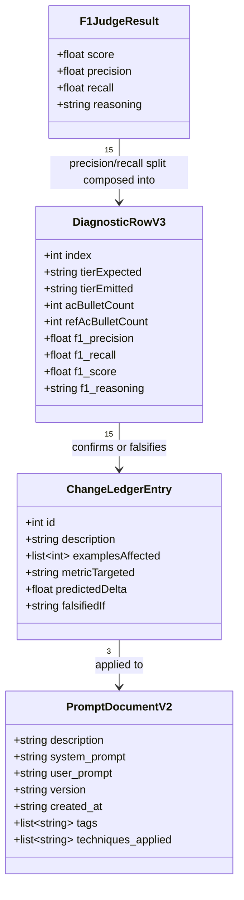

# Bug-to-User-Story v2 Prompt — F1/Recall Remediation (Iteration 4)

## Requirements

Recover the only failing metric on the published `azgrom/bug_to_user_story_v2` prompt — `f1_score` at 0.77 — to clear 0.80 with margin (~0.85), **without regressing the four metrics iteration 3 fixed** (`clarity` 0.87, `precision` 0.84, `helpfulness` 0.85, `correctness` 0.81). This is the mirror image of iteration 3: that round spent f1 headroom to buy precision (precision 0.73 → 0.84); this round spends a bounded slice of precision headroom to buy back f1. The remediation is expressed entirely inside `prompts/bug_to_user_story_v2.yml`, the only mutable artefact.

Scope boundary: `src/evaluate.py`, `src/metrics.py`, `src/utils.py` and `datasets/bug_to_user_story.jsonl` are read-only. `scripts/diagnose_v2.py` is a throwaway diagnostic and may be extended. Changing `LLM_MODEL` or `EVAL_MODEL` is out of scope — it would optimise the runtime rather than the prompt.

### Result under remediation (iteration 3 output)

```
Métricas Base:
  - F1-Score: 0.77 ✗      ← only failing metric
  - Clarity: 0.87 ✓
  - Precision: 0.84 ✓
Métricas Derivadas:
  - Helpfulness: 0.85 ✓   = (clarity + precision) / 2
  - Correctness: 0.81 ✓   = (f1 + precision) / 2  ← riding just above the line on f1
MÉDIA GERAL: 0.8278 → REPROVADO (f1 < 0.80)
```

Per-example f1 (from the iteration-3 run), grouped by reference tier:

| Tier | Examples | F1 values | Mean |
|------|----------|-----------|------|
| Simple | 1–5 | 0.75, 0.75, 0.87, 0.69, **0.58** | **0.73** |
| Medium | 6–12 | 0.69, 0.85, 0.75, **0.65**, 0.69, 0.69, 0.80 | **0.73** |
| Complex | 13–15 | 0.90, 0.90, 1.00 | **0.93** |

The complex tier is solved (iteration 3's additive change 7 landed). The entire f1 deficit is concentrated in the **simple and medium** tiers, and the iteration-2 judge reasoning strings show the cause is **recall** ("omite", "não menciona", "falta"), not precision — the answers capture the primary flow but drop the reference's *secondary* acceptance criteria.

### Diagnostic confirmation (iteration-3 baseline, `spdd/analysis/diagnostics/iteration-3-baseline.md`)

The read-only pass extended `evaluate_f1_score`'s discarded precision/recall split into a measurement. It confirms the cause **and relocates the deficit** away from where the pre-diagnostic ledger placed it:

- **F1 Recall (judge) 0.737 vs F1 Precision (judge) 0.827** — the harmonic mean is dragged by recall. Confirmed.
- **Dominant lever: the medium tier drops its second criteria group.** 5 of 7 medium references carry a supplementary criteria group (~3-5 extra bullets) that the generated answers omit, capping at ~5 bullets:

  | Ex | AC gen/ref | Missing header | F1-R |
  |----|-----------|----------------|------|
  | 8 | 5/10 | `Critérios Adicionais para Admins:` | 0.70 |
  | 10 | 5/5 | `Critérios Técnicos:` | 0.60 |
  | 11 | 5/10 | `Critérios de Prevenção:` (+ persona diverge) | 0.50 |
  | 12 | 5/6 | `Critérios de Acessibilidade:` | 0.60 |
  | 9 | 6/5 | `Exemplo de Cálculo:` | 0.80 |

  This is a larger, more concentrated hole than "ex.9 collapses to simple" — **ex.9 now emits medium correctly at f1 0.85, so the pre-diagnostic change 3 is moot.**
- **Secondary: simple over-fires to medium.** Ex.2, 4, 5 (one-line bugs) add a surplus `Contexto do Bug:` section the simple references lack — a boundary defect that hurts f1-precision and clarity, the opposite of a recall gap.
- **Tertiary: the standard-AC lever holds but is smaller** — ex.4 misses "apenas status ativo", ex.5 misses "qualidade + tempo de carregamento".

Because the dominant fix (emit the medium's second group) *matches* the reference, it raises both f1-recall and standalone precision's "Correção Factual" — this iteration is less of a precision↔recall trade than forecast. The ledger below is the post-diagnostic version.

## Entities



**Conservative constraints.** `PromptDocumentV2` keeps its exact existing YAML key set — `validate_prompt_structure` (`src/utils.py`) requires `description`, `system_prompt`, `version`, ≥2 `techniques_applied`, no `TODO`; `push_prompts.py` reads `system_prompt`/`user_prompt` by name. No key is renamed, removed or nested. `F1JudgeResult` already exists in `metrics.py:143-148` — the judge computes and returns `precision` and `recall`; only the diagnostic currently discards them. `DiagnosticRowV3` and `ChangeLedgerEntry` live only inside the throwaway script / this document; they are never introduced into `src/`.

## Approach

1. **Diagnostic-first, one read-only pass.** Re-run `scripts/diagnose_v2.py` against the *currently published* commit → `spdd/analysis/diagnostics/iteration-3-baseline.md`. The script already generates 15 answers and runs the three judges (60 LLM calls total). One extension: `evaluate_f1_score` returns the judge's separate `precision` and `recall` estimates before harmonic-meaning them (`metrics.py:143-148`); the current script logs only the final f1. Since "is the f1 loss recall or precision?" is the entire question this iteration, log **both components per example**. This converts the recall hypothesis into a measurement at zero extra cost.

2. **Remediation is recall-recovery, tightly scoped.** The references add 2–3 standard, domain-expected acceptance criteria per simple example that are *not present in the bug report* — e.g. ex.1 "botão não funciona" → reference adds *confirmação visual* + *contador atualizado*; ex.4 → *apenas usuários com status "ativo"*; ex.5 → *mesma qualidade* + *tempo de carregamento similar*. Iteration 3 hardened rule (a) into a blanket ban on any information "ausente do relato", which gagged exactly this generation and depressed recall. The precision judge does **not** count these as hallucinations (`metrics.py:284-288` — "Ausência de Alucinações" penalises *invented/unverifiable* facts, and standard ACs read as reasonable), so restoring them lifts recall with minimal precision cost.

3. **Why this is safe where iteration-3's ban was not.** The distinction the prompt must draw is between two kinds of "not in the report":
   - **Inventing technical claims** — root causes, metrics, severities, timings, affected components — which the precision judge's "Correção Factual" and "Ausência de Alucinações" punish. Stays forbidden.
   - **Generating standard acceptance criteria** a competent Product Owner would always include for that feature — visual/confirmation feedback, counter/state updates, cross-browser & cross-device parity, real-time accuracy, "only status X", error-message clarity. This is what the references do, and what recall rewards. Becomes required.
   The subject is `gpt-4o-mini` graded by `gpt-4o`; a rule the exemplars contradict loses. So rule (a) is not merely reworded — the simple few-shot is reworked to *demonstrate* filling to five concrete bullets where 2–3 are standard-but-unstated ACs.

4. **Dominant lever (per the diagnostic): the medium second criteria group.** The measurement overturned the pre-diagnostic assumption that ex.9 collapses to simple — it does not (it emits medium at f1 0.85). The real medium hole is that 5 of 7 references carry a *supplementary* criteria group (`Critérios Adicionais para Admins`, `Critérios de Prevenção`, `Critérios de Acessibilidade`, `Critérios Técnicos`, `Exemplo de Cálculo`) which the model drops, capping at ~5 bullets against references with 6–10. Making that second group reliably emitted — and lifting the medium bullet cap — is the single biggest f1 lever, and because it matches the reference it lifts standalone precision too. See ledger change 1.

5. **Guardrails held constant** so precision and clarity do not regress: the "exactly 5 bullets" cap on **simple** stays and is *tightened* (no context section on one-line reports — ledger change 2); the medium cap is *lifted* to admit the second group; `===` banners stay reserved for complex; the complex tier is untouched (0.93 — protect, don't edit).

## Structure

### Module layer (function/module based — no class hierarchy in this codebase)

1. `scripts/diagnose_v2.py` — extended (throwaway, not imported by pipeline): capture `f1["precision"]`/`f1["recall"]`, surface them in the per-example table and the footer means, retarget `OUTPUT_PATH` to the iteration-3 baseline.
2. `prompts/bug_to_user_story_v2.yml` — the artefact under remediation. Data only.
3. `src/metrics.py`, `src/utils.py`, `src/evaluate.py`, `src/push_prompts.py`, `tests/test_prompts.py` — read-only; imported/invoked, never edited.

### Execution-order layering

1. **Diagnostic layer**: `python scripts/diagnose_v2.py` → `spdd/analysis/diagnostics/iteration-3-baseline.md`, against the currently published prompt, before any edit. **This iteration stops here for user review** (per selected scope). Steps 2–6 below are the approved plan for the following turn, not executed yet.
2. **Authoring layer**: apply the three ledger changes to `prompts/bug_to_user_story_v2.yml`.
3. **Structural-gate layer**: `pytest tests/test_prompts.py -v` — green before any LLM spend.
4. **Publication layer**: `python src/push_prompts.py` — must print the Hub URL.
5. **Measurement layer**: `python src/evaluate.py`, capturing all 15 per-example lines, not only the summary.
6. **Attribution layer**: diff new per-example f1 (and, from the next diagnostic, recall) against the iteration-3 baseline row by row; mark each ledger entry confirmed or falsified.

## Operations

### Extend the diagnostic — `scripts/diagnose_v2.py`

1. Responsibility: expose the f1 recall/precision split that the deficit hinges on. No behavioural change beyond added columns and a new output path.
2. In `run_diagnostic()`: the `f1` dict already carries `precision` and `recall`. Add them to the appended row (`"f1_precision": f1["precision"], "f1_recall": f1["recall"]`).
3. In `write_report()`: add `F1-P` and `F1-R` columns to the per-example table beside `F1`; add mean f1-precision and mean f1-recall to the footer. Retitle to "iteração 3".
4. Set `OUTPUT_PATH = "spdd/analysis/diagnostics/iteration-3-baseline.md"` so the committed iteration-2 baseline is preserved as prior evidence.
5. Constraint: exactly 60 LLM calls; writes only under `spdd/analysis/diagnostics/`; still not imported by the pipeline.

### Change Ledger (iteration 4 — post-diagnostic)

Ordered by measured leverage from `iteration-3-baseline.md`. Predicted deltas are estimates to be **falsified**, not commitments — their purpose is that the next run can attribute movement to a specific change.

| # | Change | `v2.yml` target | Examples | Metric | Predicted | Falsified if |
|---|--------|-----------------|----------|--------|-----------|--------------|
| 1 | **Make the medium second criteria group reliable, and raise the medium AC budget.** The medium contract's supplementary group is currently "usually" (optional) and the model drops it; the references carry it in 5 of 7 cases with ~6–10 total bullets across two groups. State that a medium report implying a second actor/concern **emits a second criteria group**, named from a type menu (`Critérios Adicionais para Admins`, `Critérios de Prevenção`, `Critérios de Acessibilidade`, `Critérios Técnicos`, `Exemplo de Cálculo`), and lift the bullet cap so both groups render. Add/strengthen a medium few-shot that demonstrates **two** criteria groups. | medium contract, line ~25; add medium exemplar | 6, 8, 10, 11, 12 | f1 (recall) **+ standalone precision** | +0.05 – 0.08 overall | those mediums still emit only one group, or bullet count stays ~5/ref |
| 2 | **Sharpen the simple→medium boundary.** A one/two-sentence single-symptom report is simple: user story + exactly 5 bullets, **no context section**. Stop ex.2/4/5 over-firing to `Contexto do Bug:`. | simple contract, line ~20; tier trigger | 2, 4, 5 | f1 (precision-half) + clarity | +0.01 – 0.03 on 1–5 | ex.2/4/5 still emit a context section |
| 3 | **Split rule (a) + rework simple few-shot.** *Forbidden:* inventing technical causes, metrics, severities, timings, components not in the report. *Required:* generate the standard domain-expected acceptance criteria a competent PO includes even when unstated (visual/confirmation feedback, counter/state updates, cross-browser & cross-device parity, real-time accuracy, "only status X"), so the 5 simple bullets are the *right* 5. Demonstrate it in Exemplo 1. | rule (a), line ~11; Exemplo 1 | 1, 4, 5 | f1 (recall) | +0.02 on 1–5 | simple answers still stop at the literally-stated criterion |
| 4 | **Minor: persona polarity on ex.11.** Stock-validation-at-checkout is a system-integrity rule → `Como o sistema…`; the model still writes `Como um cliente`. One-line reinforcement + the ex.11 shape as the demonstration. Do not over-tune the context-section name mapping (the corpus is not cleanly type-driven — ex.9/12 use `Contexto Técnico`, ex.10/11 use `Contexto do Bug`). | rule (b), persona note | 11 | f1 (recall) | +0.01 on ex.11 | ex.11 already opens `Como o sistema` |

**Budget check.** f1 needs +0.03 to clear 0.795-rounding and +0.08 to reach the 0.85 margin. The optimistic column sums to roughly +0.09–0.14 on f1, concentrated in change 1 (the medium second group). Because changes 1–2 *match the reference shape* rather than adding free-floating content, expected standalone-precision impact is **neutral-to-positive**, not the −0.03 forecast pre-diagnostic — the precision guardrail (0.82 baseline, only 0.02 of headroom) is respected by construction. Clarity cost ~0 because the simple 5-bullet cap is *tightened*, not loosened.

### Metadata bump — `prompts/bug_to_user_story_v2.yml`

Bump `created_at` to the edit date; leave `version: "v2"` (the Hub identifier derives from the filename convention, not this field). `techniques_applied` stays truthful at three entries — Role Prompting, Chain-of-Thought and Few-shot Learning all remain present.

### Verify and publish (next turn, after review)

1. `pytest tests/test_prompts.py -v` — all six green; the persona (`Você é` + `Product Owner`), format (`Como um`/`eu quero`/`para que`), few-shot (`Exemplo 1`/`Exemplo 2`) and no-`TODO` assertions must survive the rule-(a) rewrite.
2. `python src/push_prompts.py` — must print the URL; `evaluate.py` scores the Hub commit exclusively, so an unpushed edit re-measures the old prompt.
3. `python src/evaluate.py` — capture all 15 per-example lines.
4. Diff against `spdd/analysis/diagnostics/iteration-3-baseline.md`; mark each ledger entry confirmed or falsified.

### Update documentation — `README.md`

Record iteration 4: the recall-recovery framing, the deliberate precision↔recall trade against iteration 3, the final metric values, and the two constraints still not exercised (`EVAL_MODEL` unchanged; `LLM_MODEL` not upgraded from `gpt-4o-mini`).

## Norms

1. **Prompt language**: Brazilian Portuguese throughout, matching the dataset, references and judge rubrics. No English section names or instructions.
2. **Placeholder syntax**: `{`/`}` inside `system_prompt` are `ChatPromptTemplate` variables — use `[brackets]` for illustrative placeholders. The only legitimate brace expression is `{bug_report}` in `user_prompt`.
3. **YAML formatting**: keep the `system_prompt: |` literal block scalar and two-space indentation; preserve the existing comment header and key order (the file is hand-edited, not round-tripped through `save_yaml`).
4. **Instruction style (skill-creator principle)**: prefer demonstration over declaration and explain the *why*, not heavy-handed MUSTs. Rule (a)'s split must read as a rationale the model can generalise from ("the reference expects the standard ACs a PO would include; it does not expect invented causes"), because a rule the exemplars contradict loses with `gpt-4o-mini`. Avoid ALL-CAPS absolutes; every rule that matters carries a consistent exemplar.
5. **Section naming**: reproduce the corpus's exact strings including accents (`Critérios de Aceitação:`, `Exemplo de Cálculo:`, `Contexto Técnico:`).
6. **Diagnostic conventions**: standard library plus already-installed `langchain`/`langsmith` only; no new `requirements.txt` entries; Portuguese docstrings; `❌`/`⚠️`/`✓` prefixes.

## Safeguards

1. **Functional constraint**: all five reported metrics must individually reach ≥0.80 *and* their mean ≥0.80. Target ≈0.85 per metric — `display_results` prints `:.2f` while the threshold test uses the unrounded value, so `0.80 ✗` means the true value is in `[0.7950, 0.7999]`.
2. **Protected files**: `src/evaluate.py`, `src/metrics.py`, `src/utils.py`, `datasets/bug_to_user_story.jsonl` unmodified. Importing/reading is permitted; editing invalidates the exercise.
3. **Precision regression guard**: standalone precision is at 0.82 with only 0.02 of headroom (the diagnostic's tightest margin after f1). Changes 1–2 match the reference shape and should hold or raise it. If the next run shows precision < 0.81, the culprit is change 3's rule-(a) split (licensed ACs read as slight loss of "Foco na Pergunta") — narrow the licensed AC categories there before touching changes 1–2. Do **not** revert by re-banning ACs wholesale — that reproduces the iteration-3 recall hole.
4. **Clarity regression guard**: the 5-bullet cap on simple must hold. If clarity < 0.85, the likely cause is a 6th/7th bullet creeping into simple answers — tighten the cap, do not remove the standard-AC permission.
5. **f1 attribution**: recall is the driver, not precision-of-f1. The extended diagnostic's `F1-R` column is the primary evidence; if `F1-R` rises but `f1_score` does not, the f1-precision half fell (over-production) and change 1 over-fired — narrow it.
6. **Test constraint**: `pytest tests/test_prompts.py -v` green before every push. The rule-(a) rewrite specifically threatens nothing structural, but the few-shot rework must keep `Exemplo 1` and `Exemplo 2` present.
7. **Template-safety**: no literal `{`/`}` introduced into `system_prompt` — a stray brace is a template variable and fails at `chain.invoke` as a per-example exception (silently shrinks the sample).
8. **Sequencing**: `push_prompts.py` must succeed before `evaluate.py`; editing the YAML and re-running `evaluate.py` alone re-measures the previously published commit.
9. **Measurement**: one full run = 60 LLM calls (15 `gpt-4o-mini` generations + 45 `gpt-4o` judge calls); averages are over *successful* examples only, so confirm 15 per-example lines printed before trusting a summary. A metric within ±0.02 of 0.80 is re-measured before being called a pass or fail.
10. **Scope**: do not change `LLM_MODEL`/`EVAL_MODEL`; do not edit dataset references; do not pursue the four unused judge functions (`evaluate.py` imports only three).
11. **Attribution constraint**: three changes ship together, so the per-example diagnostic baseline is what makes each falsifiable — capture `iteration-3-baseline.md` before any edit.
